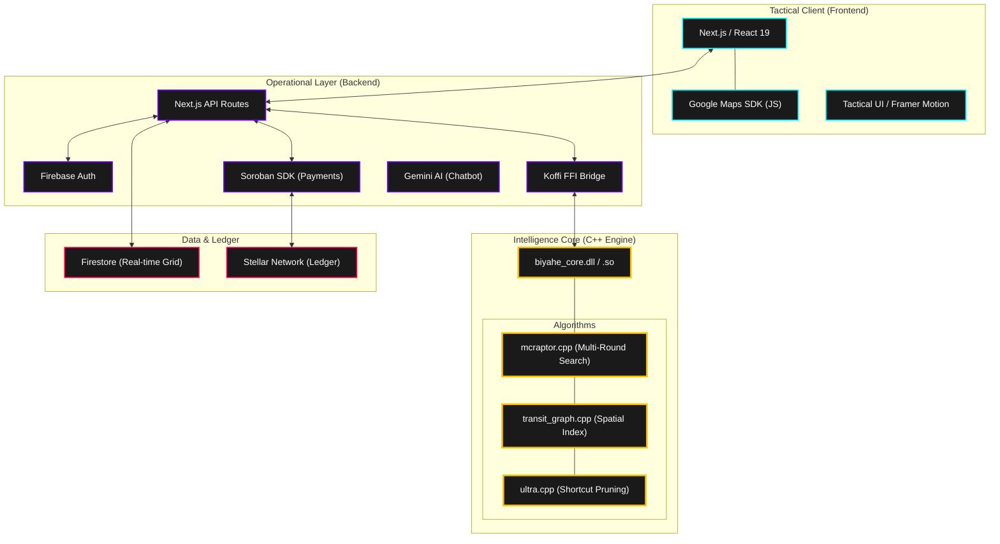
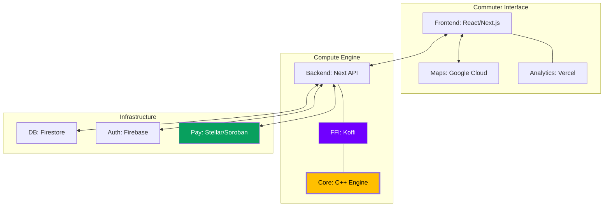

# 🚀 Biyahe: Multi-Modal Transit Neural Grid

Biyahe is a high-performance, crowdsourced public transportation mapping and routing engine designed specifically for the complex, informal, and formal transit networks of Metro Manila. It leverages a custom C++ core to navigate the "chaos" of urban mobility, providing a premium, tactical intelligence interface for both commuters and administrators.

---

## 🏛️ Full Technical Architecture

Biyahe is built on a distributed "Neural Grid" architecture that separates high-performance computation from the reactive UI layer.



---

## 🧠 The Routing Core: McRAPTOR + ULTRA

The heart of Biyahe is a C++ engine that solves the multi-modal routing problem. Unlike simple GPS apps, Biyahe must account for transfers between vastly different modes (e.g., Jeepneys without fixed schedules vs. LRT with strict arrivals).

### 💎 Economic Model & Governance (Testnet)

The Biyahe ecosystem operates on a **Reputation-First** economic model. As this project is currently in **Testnet**, the following rules apply:

*   **Trust Threshold**: To start earning $BIYAHE tokens from data contributions, users must maintain a **Trust Score of at least 75%**. New users start at a baseline, and scores are adjusted based on data accuracy (verified by AI and peer-review).
*   **Testnet Governance**: The network is currently in a controlled testnet phase. The **Admin** (Project Lead) has the authority to assign balances, adjust token allocations, and manage the site's liquidity for testing purposes.
*   **Contribution Rewards**: Validated routes and "Iskinitas" shortcuts yield higher rewards due to their high impact on the neural transit grid.

---

### 🛡️ Security & Integrity

### 📐 Algorithm Interaction Graph

```mermaid
graph LR
    subgraph "Engine Components"
        direction TB
        TG["<b>TransitGraph</b><br/>(Spatial Data Structure)"]
        UT["<b>ULTRA</b><br/>(UnLimited TRAnsfers)"]
        MC["<b>McRAPTOR</b><br/>(Multi-Objective Engine)"]
    end

    Input["User Query<br/>(Origin, Dest, Time)"] --> TG
    TG --> UT
    UT -- "Precomputed Shortcuts" --> TG
    TG -- "Network Topology" --> MC
    UT -- "Pruned Transfer Nodes" --> MC
    MC -- "Pareto Optimal Set" --> Result["Optimized Path HUD"]

    style TG fill:#111,stroke:#00f2ff
    style UT fill:#111,stroke:#ffbf00
    style MC fill:#111,stroke:#7000ff
```



#### **How it works:**
1.  **`transit_graph.cpp`**: Manages the memory-mapped representation of the city. It stores "Iskinitas" (informal shortcuts), terminals, and routes as an adjacency list optimized for cache locality.
2.  **`ultra.cpp`**: Pre-calculates walking and tricycle "shortcuts" between stations. In a city like Manila, the transfer between an LRT station and a Jeep terminal often involves a complex walking path; ULTRA ensures these are evaluated without bloating the main search rounds.
3.  **`mcraptor.cpp`**: Executes a round-based search. In each round, it explores paths with *n* transfers. It maintains a **Pareto Set**, meaning it won't just give you the "fastest" route, but also the "cheapest" and the one with "fewest transfers" simultaneously.

---

## 🔄 Detailed Operational Flowchart

This diagram illustrates the lifecycle of a single route request, from the user's tap to the final polyline rendering.

```mermaid
flowchart TD
    Start([User Requests Route]) --> Auth{Authenticated?}
    Auth -- No --> Deny[Prompt Login]
    Auth -- Yes --> Fetch[Fetch Grid State from Firestore]

    subgraph "Backend Processing"
        Fetch --> Prepare[Serialize JSON to Binary Buffer]
        Prepare --> Invoke[Call C++ query_route via Koffi]
        
        subgraph "C++ Core Execution"
            Invoke --> Build[Build Temporary Graph]
            Build --> Prune[ULTRA: Prune Redundant Transfers]
            Prune --> Solve[McRAPTOR: Solve Pareto Rounds]
            Solve --> Format[Format C++ Structs for JS]
        end
        
        Format --> Return[Return Pareto Result Array]
    end

    Return --> Filter[Heuristic Filter: User Preferences]
    Filter --> Map[Snap Coordinates to Google Road API]
    Map --> HUD[Render Tactical Route HUD]
    HUD --> End([Operative Begins Biyahe])

    style C++ Core Execution fill:#1a1a1a,stroke:#ffbf00,stroke-dasharray: 5 5
```



---

## ⚙️ C++ Integration & Koffi FFI

### Why C++?
Public transit routing in a megacity is a "Heavy Lift" for any server.
*   **Performance:** Evaluating thousands of transit combinations in real-time requires the microsecond precision of C++.
*   **Memory Control:** We use custom memory allocators for the `TransitGraph` to ensure the entire network fits in the L3 cache.
*   **Algorithmic Freedom:** Implementing McRAPTOR from scratch allows us to customize the "Cost" function to include local variables like "Wait Time under Rain" or "Jeepney Availability."

### The Bridge: Koffi FFI
We use **Koffi** instead of standard Node-API because it is significantly faster and easier to maintain.
1.  **The Library:** The core is compiled into `biyahe_core.dll` (Win) or `libbiyahe_core.so` (Linux).
2.  **Mapping:**
    ```javascript
    const lib = koffi.load('biyahe_core.so');
    const query_route = lib.func('query_route', 'void', ['string', 'string', 'pointer']);
    ```
3.  **No Overhead:** This allows the Next.js backend to call C++ functions at near-native speeds without the overhead of spawning child processes or WebAssembly's memory sandboxing.

---

## 🕸️ Detailed App Ecosystem Graph

A complete view of how all services and technologies interconnect within the Biyahe ecosystem.



---

## 🛠️ Tech Stack Breakdown

| Layer | Technologies |
| :--- | :--- |
| **Core Engine** | C++17, McRAPTOR, ULTRA Algorithm |
| **FFI Bridge** | Koffi (Fastest Node.js FFI) |
| **Frontend** | Next.js 15, React 19, Tailwind CSS 4, Framer Motion |
| **Backend** | Node.js, Next.js API Routes |
| **Persistence** | Firebase Firestore |
| **Security** | Firebase Authentication (Admin Audit System) |
| **Mapping** | Google Maps JavaScript API (Places, Routes, Geometry) |
| **Blockchain** | Stellar Lumens, Soroban Smart Contracts (Freight/Fare Payments) |

---

## 🚀 Deployment & Setup

Refer to the internal [Installation Guide](docs/INSTALL.md) to compile the C++ shared library and initialize the Firebase environment.

> [!IMPORTANT]
> Ensure the C++ compiler matches the target architecture (x64/ARM64) of your Node.js runtime to avoid FFI linkage errors.

---
*Biyahe: Mapping the chaos of Manila, one node at a time.*
Manila, one node at a time.*
